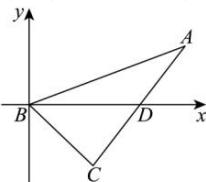

> [!faq]- 全练一本通解析
> **【解析】**
> $(x-4)^{2}+y^{2}=4(y\neq0)$ 解析:以B为原点,以BD所在的直线为x轴,建立平面直角坐标系,如图所示,
> 因为 $|BD|=3$ ,可得 $B(0,0),D(3,0)$ ,
> 设 $A(x,y)$ ，因为 $\left|\frac{|AD|}{|AB|}\right|=\frac{1}{2}$ ，可得 $\frac{\sqrt{(x-3)^{2}+y^{2}}}{\sqrt{x^{2}+y^{2}}}=\frac{1}{2}$ ，可得 $(x-4)^{2}+y^{2}=4(y\neq0)$
> 
