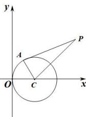

> [!faq]- 全练一本通解析
> **【答案】** $(x - 1)^{2} + y^{2} = 2$
>
> **【解析】**
> 由圆 $x^{2}+y^{2}-2x=0$ 的方程可知, 圆心为 $(1,0)$ , 半径 r=1, PA 是圆的切线且 $|PA|=1$ , 则点 P 到圆心的距离为 $\sqrt{2}$ ,
> 
> 设 $P(x,y)$ ，则 $\sqrt{(x-1)^{2}+y^{2}}=\sqrt{2}$ ，
> 化简得 $(x-1)^{2}+y^{2}=2$ .
> 故答案为： $(x-1)^{2}+y^{2}=2$
