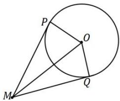

## 4. 切线长公式

圆 $x^{2} + y^{2} + Dx + Ey + F = 0$ 外一点 $M\left(x_0,y_0\right)$ 到圆的切线长： $\mid MP\mid = \sqrt{\mid MO\mid^2 - r^2}$

$$
= \sqrt {\left(x _ {0} - \frac {D}{2}\right) ^ {2} + \left(y _ {0} - \frac {E}{2}\right) ^ {2} - \frac {D ^ {2} + E ^ {2} - 4 F}{4}} = \sqrt {x _ {0} ^ {2} + y _ {0} ^ {2} + D x _ {0} + E y _ {0} + F}.
$$

