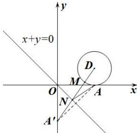

> [!faq]- 全练一本通解析
> **【解析】**
> $\sqrt{13} - 1$ 解析: 设 $A(2, 0)$ 关于直线 $x + y = 0$ 的对称点为 $A'(m, n)$ ，
> 则有 $\left\{\begin{aligned}\frac{n - 0}{m - 2} &= 1 \\ \frac{m + 2}{2} + \frac{n}{2} &= 0\end{aligned}\right.$ ，解得 $\left\{\begin{aligned}m &= 0 \\ n &= -2\end{aligned}\right.$ ，所以 $A'(0, -2)$ ，所以由对称性可知 $|MN| + |AN|$ 的最小值为 $|A'D| - 1 = \sqrt{(0 - 2)^{2} + (2 - 1)^{2}} - 1 = \sqrt{13} - 1$ .
> x + y = 0
> D.
> O
> M
> A
> N
> A′
> 
> 故答案为: $\sqrt{13} - 1$
