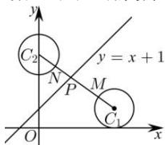

> [!faq]- 全练一本通解析
> **【答案】** 详见解析
>
> **【解析】**
> 解析: 如图所示, 由圆 $C_{1}:(x-4)^{2}+(y-1)^{2}=1$ , 可得圆心 $C_{1}(4,1)$ , 半径为 $r_{1}=1$ , 圆 $C_{2}:x^{2}+(y-4)^{2}=1$ , 可得圆心 $C_{2}(0,4)$ , 半径为 $r_{2}=1$ ,
> 可得圆心距 $\left|C_{1}C_{2}\right|=\sqrt{(4-0)^{2}+(1-4)^{2}}=5$ 如图， $\left|PM\right|\geq\left|PC_{1}\right|-r_{1},\left|PN\right|\geq\left|PC_{2}\right|-r_{2}$ 所以 $|PM|+|PN|\geq\left|PC_{1}\right|+\left|PC_{2}\right|-r_{1}-r_{2}=\left|PC_{1}\right|+\left|PC_{2}\right|-2\geq\left|C_{1}C_{2}\right|-2=3$ 当 M,N,C₁,C₂,P 共线时，取得最小值，
> 故 $\left|PM\right|+\left|PN\right|$ 的最小值为 3.
> 
