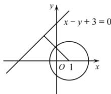

> [!faq]- 全练一本通解析
> **【答案】** A
>
> **【解析】**
> 解析: 圆 $(x-1)^{2}+y^{2}=r^{2}$ 圆心 $(1,0)$ ，
> 则圆心 $(1,0)$ 直线 $x-y+3=0$ 的距离 $d=\frac{|1-0+3|}{\sqrt{2}}=2\sqrt{2}$ ，
> 要想圆 $(x-1)^{2}+y^{2}=r^{2}$ 上到直线 $x-y+3=0$ 的距离为 $\sqrt{2}$ 的点恰有一个，
> 
> 由图得： $r=\sqrt{2}$ .
>
> 故选 **A**.
