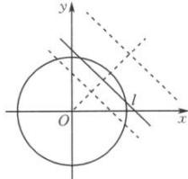

> [!faq]- 全练一本通解析
> **【解析】**
> $\left(-3\sqrt{2}, - \sqrt{2}\right)\cup \left(\sqrt{2},3\sqrt{2}\right)$
> 解析: 当圆 C 上有且仅有两个点到直线 l 的距离等于 1 时, 如下图所示.
> 
> 由于圆 C 的半径为 2,
> 故当圆 C 上有 1 个不同的点到直线 l 的距离为 1 时, 圆心到直线的距离 $d=2+1=3$ ,
> 当当圆 C 上有 3 个不同的点到直线 l 的距离为 1 时, 圆心到直线的距离 d=2-1=1,
> $$
> \left| 2 - d \right| <   1
> $$
> $$
> 1 <   d <   3
> $$
> $$
> l: x + y + m = 0
> $$
> $$
> d = \frac {| m |}{\sqrt {2}}
> $$
> $$
> 1 <   \frac {| m |}{\sqrt {2}} <   3
> $$
> $$
> - 3 \sqrt {2} <   m <   - \sqrt {2}
> $$
> $$
> \sqrt {2} <   m <   3 \sqrt {2}
> $$
> $$
> \left(- 3 \sqrt {2}, - \sqrt {2}\right) \cup \left(\sqrt {2}, 3 \sqrt {2}\right)
> $$
> 故答案为： $\left(-3\sqrt{2}, - \sqrt{2}\right)\cup \left(\sqrt{2},3\sqrt{2}\right)$
