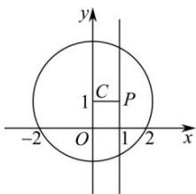

> [!faq]- 全练一本通解析
> **【解析】**
> 4解析：直线 $l: x - my - 1 + m = 0$ ，即 $(-y + 1)m + (x - 1) = 0$ ，令 $\left\{ \begin{array}{l} x - 1 = 0 \\ -y + 1 = 0 \end{array} \right.$ ，解得 $\left\{ \begin{array}{l} x = 1 \\ y = 1 \end{array} \right.$ ，所以直线 $l$ 恒过点 $P(1,1)$ ，又圆 $C: x^2 + (y - 1)^2 = 5$ 的圆心为 $C(0,1)$ ，半径 $r = \sqrt{5}$ ，因为 $|PC| = 1$ 当 $PC \perp l$ 时直线 $l$ 被圆 $C: x^2 + (y - 1)^2 = 5$ 截得的最短弦长，最短弦长为 $2\sqrt{r^2 - |PC|^2} = 2\sqrt{(\sqrt{5})^2 - 1^2} = 4$ 。
> 
