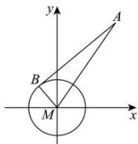

> [!faq]- 全练一本通解析
> **【答案】** B
>
> **【解析】**
> 解析: 因为圆 $M: x^{2} + y^{2} = 1$
> 
> 所以圆 M 的圆心为 $M(0,0)$ ，半径为 r=1，
> 因为 AB 与圆 M 相切，切点为 B，
> 所以 $AB \perp BM$ ，则 $\left|AB\right|^{2} + r^{2} = \left|AM\right|^{2}$ 因为 $\left|AM\right|=\sqrt{2^{2}+3^{2}}=\sqrt{13}$ 所以 $\left|AB\right|=\sqrt{\left|AM\right|^{2}-r^{2}}=\sqrt{13-1}=2\sqrt{3}$ . 故选：B.
