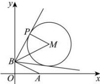

> [!faq]- 全练一本通解析
> **【答案】** $3\sqrt{2}$
>
> **【解析】**
> 设圆 $(x-5)^{2}+(y-5)^{2}=16$ 的圆心为 $M(5,5)$ ，半径为 4，
> 如下图所示: 当 $\angle PBA$ 最大时，PB 与圆 M 相切，
> 连接 MP,BM，
> 可知 $PM \perp PB$ ， $\left|BM\right|=\sqrt{\left(0-5\right)^{2}+\left(2-5\right)^{2}}=\sqrt{34}$ ， $\left|MP\right|=4$ ，
> 由勾股定理可得 $\left|PB\right|=\sqrt{\left|BM\right|^{2}-\left|MP\right|^{2}}=3\sqrt{2}$ ，故答案为： $3\sqrt{2}$
> 
