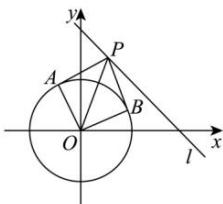

> [!faq]- 全练一本通解析
> **【解析】**
> 1
> 解析:如图所示,由圆 $O:x^{2}+y^{2}=1$ , 可得圆心 $O(0,0)$ , 半径为 r=1,
> 则四边形 PAOB 面积 $S=2\times\frac{1}{2}|PA||OA|=\left|PA\right|=\sqrt{\left|OP\right|^{2}-1}$ ,
> 要使得四边形 PAOB 面积的最小值, 只需 $\left|OP\right|$ 最小,
> 由圆心 $O(0,0)$ 到直线 l: $x + y - 2 = 0$ 的距离为 $d = \frac{|-2|}{\sqrt{2}} = \sqrt{2}$ ,
> 所以四边形 PAOB 面积的最小值为 $S_{\min}=\sqrt{(\sqrt{2})^{2}-1}=1$ . 故答案为: 1.
> 
