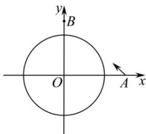

<!-- question-source:start -->
【76】（2024·重庆云阳高二练习）如图，已知一艘海监船 O 上配有雷达，其监测范围是半径为 25km 的圆形区域，一艘外籍轮船从位于海监船正东 40km 的 A 处出发，径直驶向位于海监船正北 30km 的 B 处岛屿，速度为 28km/h.

（1）求外籍船航行路径所在的直线方程；

（2）这艘外籍轮船能否被海监船监测到？若能，持续时间多长？

<!-- question-source:end -->

![[Q00007270A1]]
