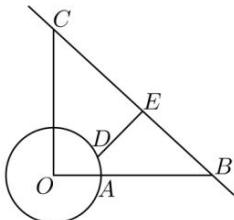

<!-- question-source:start -->
【77】为了适应市场需要, 某地准备建一个圆形生猪储备基地（如右图）, 它的附近有一条公路, 从基地中心 O 处向东走 1 km 是储备基地的边界上的点 A, 接着向东再走 7 km 到达公路上的点 B; 从基地中心 O 向正北走 8 km 到达公路的另一点 C. 现准备在储备基地的边界上选一点 D, 修建一条由 D 通往公路 BC 的专用线 DE, 求 DE 的最短距离.

<!-- question-source:end -->

![[Q00007271A1]]
