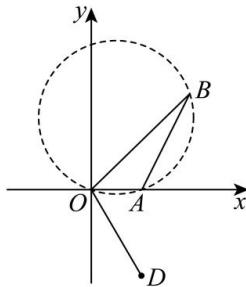

<!-- question-source:start -->
【78】如图, 某海面有 O, A, B 三个小岛（小岛可视为质点, 不计大小）, A 岛在 O 岛正东方向距 O 岛 20 千米处, B 岛在 O 岛北偏东 $45^{\circ}$ 方向距 O 岛 $40\sqrt{2}$ 千米处. 以 O 为坐标原点, O 的正东方向为 x 轴的正方向, 10 千米为一个单位长度, 建立平面直角坐标系. 圆 C 经过 O, A, B 三点.
（1）求圆 C 的方程；
(2) 若圆 C 区域内有未知暗礁, 现有一渔船 D 在 O 岛的南偏东 $30^{\circ}$ 方向距 O 岛 40 千米处, 正沿着北偏东 $30^{\circ}$ 方向行驶, 若不改变方向, 试问该渔船是否有触礁的危险? 请说明理由.

<!-- question-source:end -->

![[Q00007272A1]]
