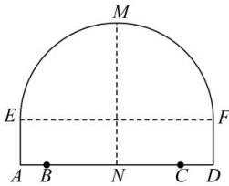

<!-- question-source:start -->
【79】(2018·北京海淀高二期中)如图所示,一隧道内设双行线公路,其截面由一段圆弧和一个长方形构成.已知隧道总宽度AD为 $6\sqrt{3}$ m,行车道总宽度BC为 $2\sqrt{11}$ m,侧墙EA、FD高为2m,弧顶高MN为5m.

（1）建立直角坐标系, 求圆弧所在的圆的方程;

(2) 为保证安全, 要求行驶车辆顶部 (设为平顶) 与隧道顶部在竖直方向上的高度之差至少要有 $0.5 \mathrm{~m}$ . 请计算车辆通过隧道的限制高度是多少.

<!-- question-source:end -->

![[Q00007273A1]]
