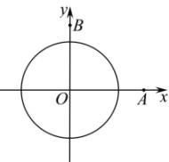

> [!faq]- 全练一本通解析
> **【答案】** （1） $3x + 4y - 120 = 0$ ；（2）能， $\frac{1}{2}$ 小时.
>
> **【解析】**
> （1）以 $O$ 为原点，东西方向为 $x$ 轴，南北方程为 $y$ 轴，建立平面直角坐标系，如图所示：
> 
> 则 $A(40,0), B(0,30)$ ，则直线 $AB: \frac{x}{40} + \frac{y}{30} = 1$ ，即 $3x + 4y - 120 = 0$ ，外籍船航行路径所在的直线方程为： $3x + 4y - 120 = 0$ ；
> （2）点 O 到直线 AB 的距离 $d=\frac{|120|}{\sqrt{3^{2}+4^{2}}}=24<25=r$ ，
> 所以外籍轮船能被海监船监测到；
> 检测路线的长度 $l=2\sqrt{r^{2}-d^{2}}=14(km)$ ,
> 则检测时间 $t=\frac{14}{28}=\frac{1}{2}(h)$ ,
> 所以外籍轮船被监测到的持续时间为 $\frac{1}{2}$ 小时.
