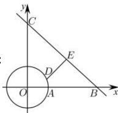

> [!faq]- 全练一本通解析
> **【解析】**
> $(4\sqrt{2}-1)$ km
> 解析：
> 
> 以 O 为坐标原点, 过 OB、OC 的直线分别为 x 轴和 y 轴, 建立平面直角坐标系, 则圆 O 的方程为 $x^{2} + y^{2} = 1$ , 因为点 $B(8,0)$ 、 $C(0,8)$ , 所以直线 BC 的方程为 $\frac{x}{8} + \frac{y}{8} = 1$ , 即 $x + y = 8$ .
> 当点 $D$ 选在与直线 $BC$ 平行的直线（距 $BC$ 较近的一条）与圆相切所成切点处时， $DE$ 为最短距离，此时 $DE$ 的最小值为 $\frac{|0 + 0 - 8|}{\sqrt{2}} - 1 = (4\sqrt{2} - 1)\mathrm{km}$ .
