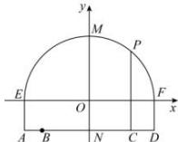

> [!faq]- 全练一本通解析
> **【答案】** （1） $x^{2} + (y + 3)^{2} = 36$ （2）3.5米
>
> **【解析】**
> （1）以 EF 所在直线为 x 轴，以 MN 所在直线为 y 轴，以 1m 为单位长度建立直角坐标系，则 $E(-3\sqrt{3},0)$ ， $F(3\sqrt{3},0)$ ， $M(0,3)$ ，
> 由所求圆的圆心在 $y$ 轴上，可设圆为 $x^{2} + (y - b)^{2} = r^{2}$
> 又 $F$ ， $M$ 在圆上，则 $\left\{ \begin{array}{l} (3\sqrt{3})^2 + b^2 = r^2 \\ 0^2 + (3 - b)^2 = r^2 \end{array} \right.$ ，解得 $b = -3$ ， $r^2 = 36$ ：
> ∴圆的方程为 $x^{2}+(y+3)^{2}=36$ .
> （2）设限高为 h，作 $CP \perp AD$ 交圆弧于 P，则 $|CP| = h + 0.5$ ，
> 将 $P$ 的横坐标 $x = \sqrt{11}$ 代入圆的方程，有 $(\sqrt{11})^2 +(y + 3)^2 = 36$ ，得 $y = 2$ 或 $y = -8$ （舍），
> $$
> \therefore h = | C P | - 0. 5 = (y + | D F |) - 0. 5 = (2 + 2) - 0. 5 = 3. 5
> $$
> 答: 车辆通过隧道的限制高度是 3.5 米.
> 
