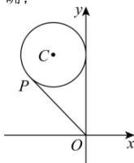

> [!faq]- 全练一本通解析
> **【答案】** AB
>
> **【解析】**
> 解析: 设圆 C 的圆心为 $C(x_{0}, y_{0})$ .
> 因为圆 C 关于直线 $x - y + 1 = 0$ 对称的圆的方程为 $(x - 4)^{2} + (y + 1)^{2} = 4$ ，
> 圆 $(x-4)^{2}+(y+1)^{2}=4$ 的圆心为 $N(4,-1)$ ，半径为 2，所以圆 C 的半径为 2，
> 两圆的圆心关于直线 $x-y+1=0$ 对称，则 $\left\{\begin{aligned}\frac{y_{0}+1}{x_{0}-4}&=-1,\\ \frac{x_{0}+4}{2}&-\frac{y_{0}-1}{2}+1=0,\end{aligned}\right.$ 解得 $\left\{\begin{aligned}x_{0}&=-2,\\ y_{0}&=5,\end{aligned}\right.$ 所以 $C(-2,5)$ ，故圆 C 的方程为 $(x+2)^{2}+(y-5)^{2}=4$ .
> 对于 A, $\frac{y}{x}$ 的几何意义为圆 C 上的点 $P(x,y)$ 与坐标原点 $O(0,0)$ 连线的斜率,
> 如图, 过原点 O 作圆 C 的切线, 当切线的斜率存在时, 设切线方程为 y=kx , 即 kx-y=0 , 所以圆心 $C(-2,5)$ 到直线 kx-y=0 的距离 $d=\frac{|2k+5|}{\sqrt{k^{2}+1}}=2$ ，解得 $k=-\frac{21}{20}$ ，故由图可知 $\frac{y}{x}$ 的最大值是 $-\frac{21}{20}$ ，故 A 正确。
> 
> 对于 B, 圆心 $C(-2,5)$ 在直线 $2x + y - 1 = 0$ 上, 则圆 C 关于直线
> $$
> 2 x + y - 1 = 0
> $$
> 对于 C, $\left|x-y+1\right|$ 表示圆 C 上任意一点到直线 $x-y+1=0$ 的距离的 $\sqrt{2}$ 倍, 圆心 $C(-2,5)$ 到直线 $x-y+1=0$ 的距离为 $\frac{6}{\sqrt{2}}=3\sqrt{2}$ , 所以 $\left|x-y+1\right|$ 的最小值是 $\sqrt{2}(3\sqrt{2}-2)=6-2\sqrt{2}$ , 故 C 错误;
> 对于 D, 圆心 $C(-2,5)$ 到直线 $2x + y + 5 = 0$ 的距离为 $\frac{6}{\sqrt{5}} > 2$ , 所以直线 $2x + y + 5 = 0$ 与圆 C 相离, 故 D 错误.
>
> 故选 **AB**.
