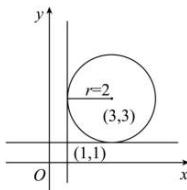
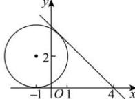

> [!faq]- 全练一本通解析
> **【解析】**
> （1） $0, - \frac{20}{21}$ ；（2） $2\sqrt{2} +2,2\sqrt{2} -2$
> 
> $$
> x ^ {2} + y ^ {2} + 2 x - 4 y + 1 = 0
> $$
> $$
> (x + 1) ^ {2} + (y - 2) ^ {2} = 4
> $$
> 此方程表示以 $(-1,2)$ 为圆心,2为半径的圆.
> （1） $\frac{y}{x-4}$ 表示圆上的点 $(x, y)$ 与定点 $(4,0)$ 连线的斜率，
> 所以令 $\frac{y}{x-4}=k$ ，即 $y=k(x-4)$ .
> 当直线 $y=k(x-4)$ 与已知圆相切时（如图）， $\frac{y}{x-4}$ 取得最值，
> 所以 $\frac{\left|-k-2-4k\right|}{\sqrt{k^{2}+1}}=2$ ，解得 k=0 或 $k=-\frac{20}{21}$ .
> 因此 $\frac{y}{x-4}$ 的最小值是 $-\frac{20}{21}$ ，最大值为 0.
> 
> （2） $\sqrt{x^2 + y^2 - 2x + 1} = \sqrt{(x - 1)^2 + (y - 0)^2}$ ，它表示圆上的点 $(x, y)$ 与定点(1,0)的距离.
> 因为定点 $(1,0)$ 到已知圆的圆心距离为 $d=\sqrt{(-1-1)^{2}+2^{2}}=2\sqrt{2}$ ，所以 $\sqrt{x^{2}+y^{2}-2x+1}$ 的最大值为 $d+r=2\sqrt{2}+2$ ，最小值为 $d-r=2\sqrt{2}-2$ 。
