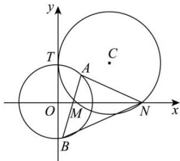

<!-- question-source:start -->
【8】如图, 已知圆 C 与 y 轴相切于点 $T(0,2)$ , 与 x 轴的正半轴交于 M, N (点 M 在点 N 的左侧) 两点, 且 MN = 3.

（1）求圆 C 的方程；
（2）过点 M 任作一直线与圆 $O: x^{2} + y^{2} = 4$ 相交于 A, B 两点, 连结 AN, BN, 试探究: 直线 AN 与直线 BN 的斜率的和 $k_{AN} + k_{BN}$ 是否为定值?

<!-- question-source:end -->

![[Q00007475A1]]
