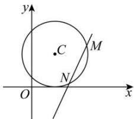

> [!faq]- 全练一本通解析
> **【答案】** （1）圆心 $C(2,3)$ ，半径 $r = 3$ （2） $2x - y - 6 = 0$ （3）16
>
> **【解析】**
> （1）将圆 $C: x^2 + y^2 - 4x - 6y + 4 = 0$ 化为标准方程： $(x - 2)^2 + (y - 3)^2 = 9$ ，则圆心 $C(2,3)$ ，半径 $r = 3$ ；（2）当直线 $l$ 的斜率不存在时，直线 $l$ 的方程为 $x = 4$ ，在圆 $C: x^2 + y^2 - 4x - 6y + 4 = 0$ 中，令 $x = 4$ ，得 $y^2 - 6y + 4 = 0$ ，解得 $y = 3 \pm \sqrt{5}$ ，此时 $|MN| = 2\sqrt{5}$ ，与题意矛盾，所以直线 $l$ 的斜率存在，设斜率为 $k$ ，则直线 $l$ 的方程为 $y - 2 = k(x - 4)$ ，即 $kx - y - 4k + 2 = 0$ ，因为 $|MN| = 4$ ，所以圆心 $C(2,3)$ 到直线 $l$ 的距离 $d = \sqrt{r^2 - \left(\frac{|MN|}{2}\right)^2} = \sqrt{9 - 4} = \sqrt{5}$ ，所以 $\frac{|2k - 3 - 4k + 2|}{\sqrt{k^2 + 1}} = \sqrt{5}$ ，解得 $k = 2$ ，所以直线 $l$ 的方程为 $2x - y - 6 = 0$ ，综上所述，直线 $l$ 的方程为 $2x - y - 6 = 0$ ；（3）设 $M(x_1, y_1), N(x_2, y_2)$ ，联立 $\begin{cases} 2x - y - 6 = 0 \\ x^2 + y^2 - 4x - 6y + 4 = 0 \end{cases}$ ，消 $y$ 得 $5x^2 - 40x + 76 = 0$ ，则 $x_1 + x_2 = 8, x_1x_2 = \frac{76}{5}$ ，故 $y_1y_2 = (2x_1 - 6)(2x_2 - 6) = 4x_1x_2 - 12(x_1 + x_2) + 36 = \frac{4}{5}$ ，所以 $\overrightarrow{OM} \cdot \overrightarrow{ON} = x_1x_2 + y_1y_2 = \frac{76}{5} + \frac{4}{5} = 16$ 。
> 
