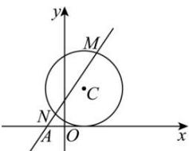

> [!faq]- 全练一本通解析
> **【答案】** （1）证明见解析（2） $\frac{1 + \sqrt{5}}{2}$
>
> **【解析】**
> （1）证明：圆 $C$ 的方程可化为 $\lambda (x^{2} + y^{2} - 5) - 2x - 4y + 6 = 0$ 令 $\left\{ \begin{array}{l}x^{2} + y^{2} = 5\\ -2x - 4y + 6 = 0 \end{array} \right.$ 得 $\left\{ \begin{array}{l}x = -1\\ y = 2 \end{array} \right.$ 或 $\left\{ \begin{array}{l}x = \frac{11}{5}\\ y = \frac{2}{5} \end{array} \right.$ 故圆 $C$ 恒过两个定点，且这两个定点的坐标为 $(-1,2)$ 和 $\left(\frac{11}{5},\frac{2}{5}\right)$ （2）解：当 $\lambda = 1$ 时，圆 $C$ 的方程可化为 $x^{2} + y^{2} - 2x - 4y + 1 = 0$ 由题知直线 $l$ 的斜率 $k$ 存在且不为0，设直线 $l$ 的方程为 $y = k(x + 1)$
> 
> 联立 $\left\{ \begin{array}{l} x^{2} + y^{2} - 2x - 4y + 1 = 0, \\ y = k(x + 1), \end{array} \right.$ 消去 $x$ 得 $(1 + k^2)y^2 - 4k(1 + k)y + 4k^2 = 0$ ，所以 $\left\{ \begin{array}{l} y_1 + y_2 = \frac{4k(1 + k)}{1 + k^2}, \\ y_1y_2 = \frac{4k^2}{1 + k^2}, \end{array} \right.$ $\Delta = 16k^2 (1 + k)^2 - 16k^2 (1 + k^2) > 0$ ，解得 $k > 0$ 。因为 $\frac{1}{y_1} + \frac{1}{y_2} = \frac{y_1 + y_2}{y_1y_2} = \frac{1 + k}{k}$ ，所以 $\frac{1 + k}{k} = k$ ，解得 $= \frac{1 \pm \sqrt{5}}{2}$ ，又 $k > 0$ ，所以 $k = \frac{1 + \sqrt{5}}{2}$ 。
