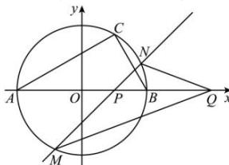

> [!faq]- 全练一本通解析
> **【答案】** (1) $x^2 + y^2 = 4(y \neq 0)$ (2) $Q(4,0)$
>
> **【解析】**
> (1) 设 $C$ 点的坐标为 $(x,y)$ , 由题意知 $k_{AC}$ , $k_{BC}$ 存在, 且 $y \neq 0$ ,
> 因为 $AC \perp BC$ , 所以 $k_{AC}k_{BC} = \frac{y}{(x + 2)} \times \frac{y}{(x - 2)} = -1$ , 整理可得 $x^2 + y^2 = 4$ ,
> 故曲线 $T$ 的方程为 $x^2 + y^2 = 4(y \neq 0)$ .
> （2）不妨设直线 $l$ 的方程为 $x = my + 1$ , 点 $M$ 、 $N$ 的坐标分别为 $(x_1, y_1)$ 、 $(x_2, y_2)$ , 联立 $\left\{ \begin{array}{l} x = my + 1 \\ x^2 + y^2 = 4 \end{array} \right.$ , 整理得 $(m^2 + l)y^2 + 2my - 3 = 0$ ,
> 由韦达定理得 $y_1 + y_2 = -\frac{2m}{1 + m^2}$ (1), $y_1y_2 = -\frac{3}{1 + m^2}$ (2).
> 要使 $\angle PQM = \angle PQN$ , 则 $k_{MQ} + k_{NQ} = 0$ ,
> 则 $\frac{y_1}{x_1 - a} + \frac{y_2}{x_2 - a} = \frac{x_2y_1 - ay_1 + x_1y_2 - ay_2}{(x_1 - a)(x_2 - a)} = 0$ , 即 $x_2y_1 - ay_1 + x_1y_2 - ay_2 = 0$ ,
> 又因为 $x_1 = my_1 + 1$ , $x_2 = my_2 + 1$ ,
> 所以 $(my_2 + l)y_1 - ay_1 + (my_1 + l)y_2 - ay_2 = 0$ , 即 $2my_1y_2 + (1 - a)(y_1 + y_2) = 0$ ,
> 代入①②两式, 化简得 $2m(a - 4) = 0$ ,
> 由 $m$ 的任意性可知 $a = 4$ , 即 $Q(4,0)$ 满足要求.
> 
