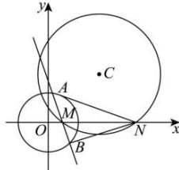

> [!faq]- 全练一本通解析
> **【答案】** （1） $x^{2}+y^{2}-x=0$ 或 $x^{2}+y^{2}-5x-4y+4=0$ （2）a=9
>
> **【解析】**
> （1）由 $\left\{\begin{aligned}x&=0\\ x^{2}&-(1+a)x+y^{2}-ay+a=0\end{aligned}\right.$ 得 $y^{2}-ay+a=0$ ，
> 因为圆与 y 轴相切，所以 $\Delta=a^{2}-4a=0$ ，解得 a=0 或 4，
> 故所求圆 C 的方程为 $x^{2}+y^{2}-x=0$ 或 $x^{2}+y^{2}-5x-4y+4=0$ 。
> （2）令 y=0 得 $x^{2}-(1+a)x+a=0$ 解得 x=1 或 x=a，而 a>1，即 $M(1,0)$ ， $N(a,0)$ .
> 设 $A(x_{1},y_{1})$ ， $B(x_{2},y_{2})$ ，
> 当直线 AB 与 x 轴不垂直时，设直线 AB 的方程为 $y=k(x-1)$ ，
> 由 $\left\{\begin{aligned}y=k(x-1)\\ x^{2}+y^{2}=9\end{aligned}\right.$ 得 $(1+k^{2})x^{2}-2k^{2}x+k^{2}-9=0$ $\therefore x_{1}+x_{2}=\frac{2k^{2}}{1+k^{2}}$ ， $x_{1}x_{2}=\frac{k^{2}-9}{1+k^{2}}$ 又 $\angle ANM = \angle BNM$ ，即 NA, NB 的斜率互为相反数，
> $$
> \therefore \frac {y _ {1}}{x _ {1} - a} + \frac {y _ {2}}{x _ {2} - a} = 0,
> $$
> 即 $(x_{1} - 1)(x_{2} - a) + (x_{2} - 1)(x_{1} - a) = 0$
> 整理得 $2x_{1}x_{2} - (a + 1)(x_{1} + x_{2}) + 2a = 0$
> 所以 $\frac{2(k^{2}-9)}{1+k^{2}}-\frac{2(a+1)k^{2}}{1+k^{2}}+2a=0$ ，即 2a-18=0 ，解得 a=9 。
> 当直线 AB 与 x 轴垂直时，仍然满足 $\angle ANM = \angle BNM$ ，
> 即 NA, NB 的斜率互为相反数.
> 综上所述，a=9。
> 
