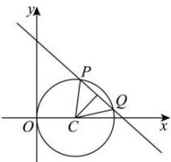
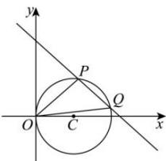

> [!faq]- 全练一本通解析
> **【答案】** （1） $m = -1$ 或 $m = -7$ （2） $\left(-2, -\frac{3}{4}\right)$
>
> **【解析】**
> （1）
> 
> 将圆 $C: x^{2} - x + y^{2} = 0$ 的方程化为标准方程 $\left(x - \frac{1}{2}\right)^{2} + y^{2} = \frac{1}{4}$ ，
> 圆心 $C\left(\frac{1}{2},0\right)$ ，半径 $r=\frac{1}{2}$ ，由 $PQ=\frac{\sqrt{2}}{2}$ ，
> 可知圆心 $C\left(\frac{1}{2},0\right)$ 到直线 l 得距离为 $\sqrt{r^{2}-\left(\frac{PQ}{2}\right)^{2}}=\frac{\sqrt{2}}{4}$ ，
> 所以 $\frac{\left|\frac{m}{2}+1\right|}{\sqrt{m^{2}+1}}=\frac{\sqrt{2}}{4}$ ，解得 m=-1 或 m=-7；
> (2)
> 
> 设 $P(x_{1},y_{1}),Q(x_{2},y_{2})$ 联立 $\left\{ \begin{array}{l}x^{2} - x + y^{2} = 0\\ y = mx + 1 \end{array} \right.$ ，得 $(m^2 +1)x^2 +(2m - 1)x + 1 = 0$ 由 $\Delta = (2m - 1)^2 -4(m^2 +1) > 0$ ，得 $m <   - \frac{3}{4}$ 且 $x_{1} + x_{2} = -\frac{2m - 1}{m^{2} + 1},x_{1}x_{2} = \frac{1}{m^{2} + 1},$ 因为点 $O$ 在以 $PQ$ 为直径的圆外，所以 $\overline{OP}\cdot \overline{OQ} >0$ 即 $x_{1}x_{2} + y_{1}y_{2} = x_{1}x_{2} + (mx_{1} + 1)(mx_{2} + 1) = (1 + m^{2})x_{1}x_{2} + m(x_{1} + x_{2}) + 1 > 0$ 即 $\left(1 + m^2\right)\frac{1}{m^2 + 1} +m\left(-\frac{2m - 1}{m^2 + 1}\right) + 1 > 0$ 解得 $m > - 2$ ，所以 $m$ 的取值范围是 $\left(-2, - \frac{3}{4}\right)$
