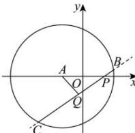
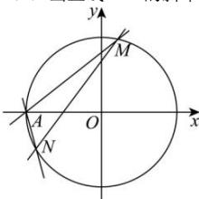
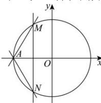

> [!faq]- 全练一本通解析
> **【解析】**
> （1） $x^{2} + y^{2} = 4$ （2）证明见解析
> 解析：（1）因为 $Q$ 是弦 $BC$ 的中点，
> 
> 所以 $AQ \perp BC$ ，即 $AQ \perp PQ$ ，
> 所以点 $Q$ 的轨迹为以 $AP$ 为直径的圆, 所以曲线 $E$ 的方程为 $x^{2} + y^{2} = 4$ .
> （2）当直线 MN 的斜率存在时，
> 
> 设直线 MN 的方程为 $y = kx + t$ ,
> 代入 $x^{2}+y^{2}=4$ ，得 $(k^{2}+1)x^{2}+2ktx+t^{2}-4=0$ 。
> 设 $M(x_{1},y_{1})$ ， $N(x_{2},y_{2})$ ，则 $x_{1}$ ， $x_{2}$ 是方程的两解，
> 则 $\Delta>0,\quad x_{1}+x_{2}=-\frac{2kt}{k^{2}+1},\quad x_{1}x_{2}=\frac{t^{2}-4}{k^{2}+1},$ $k_{1}k_{2}=\frac{y_{1}}{x_{1}+2}\cdot\frac{y_{2}}{x_{2}+2}=\frac{kx_{1}+t}{x_{1}+2}\cdot\frac{kx_{2}+t}{x_{2}+2}=\frac{k^{2}x_{1}x_{2}+kt(x_{1}+x_{2})+t^{2}}{x_{1}x_{2}+2(x_{1}+x_{2})+4}=-3$ 根据根与系数的关系，得 $t^{2}-3kt+2k^{2}=0$ 即 $(t-k)(t-2k)=0$ 若 t-2k=0，则直线 MN 过点 A，舍去；
> 所以 t-k=0，即 t=k，
> 直线 MN 的方程为 $y=k(x+1)$ ，故直线过定点 $(-1,0)$ .
> 当直线 MN 斜率不存在时，设直线 MN： $x=t(-2<t<2)$
> 
> 与曲线 E 的方程联立, 可得 $M(t, \sqrt{4 - t^{2}})$ , $N(t, -\sqrt{4 - t^{2}})$ , 则 $k_{1}k_{2}=-\frac{4-t^{2}}{(t+2)^{2}}=-3$ , 解得 t=-1 ,
> 故直线 MN 的方程为 x=-1 ，恒过点 $(-1,0)$ .
> 综上，直线 MN 过定点 $(-1,0)$ .
