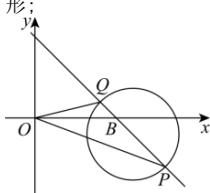

> [!faq]- 全练一本通解析
> **【解析】**
> （1） $(x-6)^{2}+(y+1)^{2}=8$ （2） $x+y-5=0$ 解析：（1）设 $M(x,y)$ ，因为 $\frac{|MA|}{|MB|}=2$ ，
> 所以 $\sqrt{(x-2)^{2}+(y-3)^{2}}=2\sqrt{(x-5)^{2}+y^{2}}$ 化简得 $(x-6)^{2}+(y+1)^{2}=8$ 故曲线 E 的方程为 $(x-6)^{2}+(y+1)^{2}=8$ ;
> （2）若直线 l 垂直于 y 轴, 则 O, P, B, Q 四点共线, 不能构成三角形:
> 
> 故可设直线 l 的方程为 $x = my + 5$ ,
> 代入曲线 E 的方程可得 $\left(m^{2}+1\right)y^{2}+\left(2-2m\right)y-6=0$ $\Delta=\left(2-2m\right)^{2}+24\left(m^{2}+1\right)>0$ 则 $y_{P} + y_{Q} = \frac{2m - 2}{m^{2} + 1}$ ， $y_{P}y_{Q} = \frac{-6}{m^{2} + 1}$ 又 $S_{\triangle OBP} = \frac{1}{2} |OB| \cdot |y_{P}|$ ， $S_{\triangle OBO} = \frac{1}{2} |OB| \cdot |y_{Q}|$ $S_{\triangle OBP}=3S_{\triangle OBO}$ ，故 $\left|y_{P}\right|=3\left|y_{Q}\right|$ 因为 $y_{P}y_{Q}=\frac{-6}{m^{2}+1}<0$ ，故 $y_{P}=-3y_{Q}$ 则 $y_{P} + y_{Q} = -2y_{Q} = \frac{2m - 2}{m^{2} + 1}$ 故 $y_{Q}=\frac{1-m}{m^{2}+1}$ ， $y_{P}=\frac{3m-3}{m^{2}+1}$ 则有 $y_{P}y_{Q}=\frac{1-m}{m^{2}+1}\cdot\frac{3m-3}{m^{2}+1}=\frac{-6}{m^{2}+1}$ 可得 $(m+1)^{2}=0$ ，故 m=-1，
> 则直线 l 方程为 $x + y - 5 = 0$ 。
