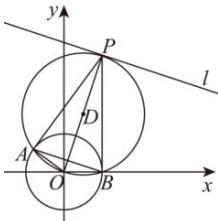
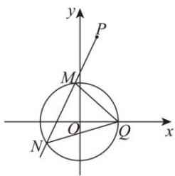

> [!faq]- 全练一本通解析
> **【答案】** （1） $x+3y-1=0$ （2）证明见解析
>
> **【解析】**
> （1）圆 $C:x^{2} + y^{2} = 1$ ，圆心为 $(0,0)$ ，半径为1，已知 $PA,PB$ 是圆 $C$ 的两条切线，则 $\left|PA\right|^2 = \left|PO\right|^2 -1$ 所以当 $\left|PO\right|$ 最小时， $\left|PA\right|$ 最小. $\left|PO\right|$ 最小值即为点 $O$ 到直线 $l$ 的距离 $d = \frac{\left| - 10\right|}{\sqrt{1^2 + 3^2}} = \sqrt{10}$ 此时 $OP\bot l$ ，且直线 $l:x + 3y - 10 = 0$ ，直线 $l$ 的斜率 $k_{l} = -\frac{1}{3}$ 设 $P(a,b)$ ，则有 $\left\{\frac{b}{a}\cdot \left(-\frac{1}{3}\right) = -1\right.$ ，解得 $\left\{ \begin{array}{ll}a = 1\\ b = 3 \end{array} \right.$ ，即 $P(1,3)$ 由 $OA\bot AP,OB\bot BP$ ，得 $O,A,P,B$ 四点共在以 $OP$ 为直径的圆上，圆心为 $OP$ 的中点，设为 $D$ ，坐标为 $\left(\frac{1}{2},\frac{3}{2}\right)$ ，圆的半径为 $\frac{\left|OP\right|}{2} = \frac{\sqrt{10}}{2}$ 则圆 $D$ 的方程为 $\left(x - \frac{1}{2}\right)^2 +\left(y - \frac{3}{2}\right)^2 = \frac{5}{2}$ ，即 $x^{2} + y^{2} - x - 3y = 0$ ①，又圆 $C:x^{2} + y^{2} - 1 = 0$ ②，则两圆方程相减得公共弦 $AB$ 的方程，即由②-①得， $x + 3y - 1 = 0$ 即直线 $AB$ 的方程为 $x + 3y - 1 = 0$ ：
> 
> （2）由题意知，过点 $P(1,3)$ 的直线 $l^{\prime}$ 斜率存在，
> 故可设方程为 $y - 3 = k(x - 1)$ ，即 $y = kx + 3 - k$ ，
> 设 $M(x_{1},y_{1}),N(x_{2},y_{2})$ ，且 $x_{1} <   1,x_{2} <   1$ 由题意 $QM$ 的斜率 $k_{1} = \frac{y_{1}}{x_{1} - 1},QN$ 的斜率 $k_{2} = \frac{y_{2}}{x_{2} - 1}$ 则 $k_{1} + k_{2} = \frac{y_{1}}{x_{1} - 1} +\frac{y_{2}}{x_{2} - 1} = \frac{k(x_{1} - 1) + 3}{x_{1} - 1} +\frac{k(x_{2} - 1) + 3}{x_{2} - 1} = 2k + \frac{3(x_1 + x_2 - 2)}{(x_1 - 1)(x_2 - 1)}.$ 联立 $\left\{ \begin{array}{ll}x^{2} + y^{2} = 1\\ y = kx + 3 - k \end{array} \right.$ 整理得 $(1 + k^2)x^2 +2k(3 - k)x + k^2 -6k + 8 = 0$ 则 $\Delta = 4k^{2}(3 - k)^{2} - 4(1 + k^{2})(k^{2} - 6k + 8) = 8(3k - 4) > 0$ ，即 $k > \frac{4}{3}$ 由韦达定理知， $x_{1} + x_{2} = \frac{2k(k - 3)}{1 + k^{2}},x_{1}x_{2} = \frac{k^{2} - 6k + 8}{1 + k^{2}}$ 则 $x_{1} + x_{2} - 2 = \frac{2k(k - 3)}{1 + k^{2}} -2 = \frac{-6k - 2}{1 + k^{2}},$ $(x_{1} - 1)(x_{2} - 1) = x_{1}x_{2} - (x_{1} + x_{2}) + 1 = \frac{k^{2} - 6k + 8}{1 + k^{2}} -\frac{2k(k - 3)}{1 + k^{2}} +\frac{1 + k^{2}}{1 + k^{2}} = \frac{9}{1 + k^{2}},$ 故 $k_{1} + k_{2} = 2k + \frac{3\frac{-6k - 2}{1 + k^{2}}}{\frac{9}{1 + k^{2}}} = 2k + \frac{-6k - 2}{3} = -\frac{2}{3},$ 故 $k_{1} + k_{2}$ 为定值 $-\frac{2}{3}$
> 
