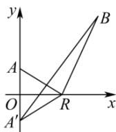

> [!faq]- 全练一本通解析
> **【解析】**
> 5
> 解析：如图，设点 A(0,1) 关于 x 轴的对称点为 A'(0,-1)，则 AR=A'R，
> 所以 AR+BR=A'R+BR≥A'B，
> 所以动点 R 到两个定点 A(0,1)，B(3,3) 的距离之和的最小值为 A'B 的长，
> 因为 $|A'B|=\sqrt{3^{2}+4^{2}}=5$ 所以 x 轴上的动点 R 到两个定点 A(0,1)，B(3,3) 的距离之和的最小值为
> 5，故答案为：5
> 
