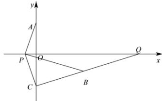

> [!faq]- 全练一本通解析
> **【答案】** A
>
> **【解析】**
> 解析:由已知点 A 关于 x 轴的对称点为 $C(0,-2)$ , $k_{BC}=\frac{-1+2}{3-0}=\frac{1}{3}$ ，直线 BC 方程为 $y=\frac{1}{3}x-2$ ，令 y=0 得 x=6，
> 所以直线 BC 与 x 轴交点为 $Q(6,0)$ , $\left|PA\right|-\left|PB\right|=\left|PC\right|-\left|PB\right|\leq\left|CB\right|=\sqrt{(3-0)^{2}+(-1+2)^{2}}=\sqrt{10}$ ，当且仅当 P 是 BC 与 x 轴交点 Q 时等号成立。故选：A.
> 
