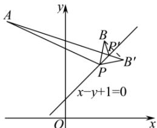

> [!faq]- 全练一本通解析
> **【答案】** C
>
> **【解析】**
> 解析:如图,显然点 A,B 在直线 $x-y+1=0$ 的同侧,设点 B 关于直线 $x-y+1=0$ 的对称点为点 $B'(a,b)$ ,
> 则 $\left\{\begin{aligned}\frac{a+2}{2}-\frac{b+4}{2}+1&=0\\ \frac{b-4}{a-2}&=-1\end{aligned}\right.$ ，解得 a=3, b=3，即点 $B^{\prime}(3,3)$ ,
> 由对称性知 $\left|PA\right|+\left|PB\right|=\left|PA\right|+\left|PB'\right|\geq\left|AB'\right|=\sqrt{\left(-3-3\right)^{2}+\left(5-3\right)^{2}}=2\sqrt{10}$ ，当且仅当点 P 为线段 $AB'$ 与直线 $x-y+1=0$ 的交点 $P'$ 时取等号，
> 
> 所以 $\left|PA\right|+\left|PB\right|$ 的最小值是 $2\sqrt{10}$ . 故选: C
