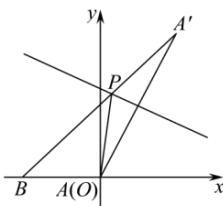

> [!faq]- 全练一本通解析
> **【答案】** A
>
> **【解析】**
> 解析：
> 
> 如图, 设 A 关于直线 $x + 2y - 5 = 0$ 对称的点为 $A'(a, b)$ ,
> 则 $\left\{\begin{aligned}\frac{a}{2}+2\cdot\frac{b}{2}-5=0,\\ \frac{b}{a}\cdot\left(-\frac{1}{2}\right)=-1,\end{aligned}\right.$ 得 $\left\{\begin{aligned}a=2,\\ b=4,\end{aligned}\right.$ 即 $A^{\prime}(2,4)$ ,
> 易知 $\left|AP\right|=\left|A^{\prime}P\right|$ 当 $A', P, B$ 三点共线时， $\left|PA\right|+\left|PB\right|=\left|PA'\right|+\left|PB\right|$ 取得最小值，
> 最小值为 $\left|A^{\prime}B\right|=\sqrt{(2+2)^{2}+(4-0)^{2}}=4\sqrt{2}$ . 故选：A
