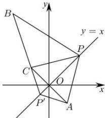

> [!faq]- 全练一本通解析
> **【答案】** $\sqrt{10}$
>
> **【解析】**
> 设点 $A(1,-1)$ 关于l:y=x的对称点为 $C(m,n)$ ，
> 则 $\left\{\begin{aligned}\frac{n+1}{m-1}&=-1\\ \frac{n-1}{2}&=\frac{m+1}{2}\end{aligned}\right.$ ，解得 $\left\{\begin{aligned}m&=-1\\ n&=1\end{aligned}\right.$ ，故 $C(-1,1)$ ，
> 由对称性可知， $\left|PA\right|=\left|PC\right|$ ，
> 当B,C,P可组成三角形时，根据三角形三边关系得到 $\left|PB\right|-\left|PC\right|<\left|BC\right|$ ，
> 连接BC并延长，交l:y=x于点 $P'$ ，则此时 $\left|P^{\prime}B\right|-\left|P^{\prime}A\right|=\left|BC\right|$ ，
> 即当B,C,P三点共线时， $\left|PB\right|-\left|PA\right|$ 取得最大值，
> 最大值为 $\left|BC\right|=\sqrt{\left(-2+1\right)^{2}+\left(4-1\right)^{2}}=\sqrt{10}$ 。
> 故答案为： $\sqrt{10}$
> 
