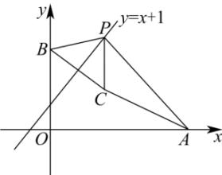

> [!faq]- 全练一本通解析
> **【解析】**
> √3.
> 解析:由直线 $3x + 4y - 12 = 0$ 分别交 x 轴和 y 于点 A, B，可得 $A(4,0), B(0,3)$ 如图所示, 设点 $B(0,3)$ 关于直线 $y = x + 1$ 的对称点为 $C(m, n)$ ,
> 则 $\left\{\begin{aligned}\frac{n-3}{m}\times1&=-1\\ \frac{n+3}{2}&=\frac{m}{2}+1\end{aligned}\right.$ ，解得 m=2,n=1，即 $C(2,1)$ ，
> 又由 $\left|PB\right|=\left|PC\right|$ ，即 $\left|PA\right|-\left|PB\right|=\left|PA\right|-\left|PC\right|$ ，则 $\left|PA\right|-\left|PC\right|\leq\left|AC\right|$ ，
> 当且仅当 A,C,P 三点共线时，等号成立，
> 即 $\left|PA\right|-\left|PC\right|$ 的最大值为 $\left|AC\right|=\sqrt{(4-2)^{2}+(0-1)^{2}}=\sqrt{5}$ ，即 $\left|PA\right|-\left|PB\right|$ 的最大值为 $\sqrt{5}$ . 故答案为： $\sqrt{5}$ .
> 
