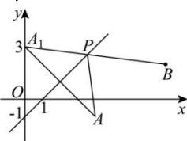

> [!faq]- 全练一本通解析
> **【解析】**
> $\sqrt{65}$
> 解析：
> 
> 设 $A(4, - 1)$ 关于 $l:x - y - 1 = 0$ 的对称点为 $A_{1}(m,n)$ 则 $\frac{4 + m}{2} -\frac{n - 1}{2} -1 = 0,k_{AA_1} = \frac{n + 1}{m - 4} = -1$ 解之得 $m = 0,n = 3$ 故 $A_{1}(0,3)$ 连接 $BA_{1}$ 交直线 $l$ 于点 $P$ ，如图所示
> 则此时 $\left|PA\right| + \left|PB\right|$ 取得最小值为 $\left|BA_1\right| = \sqrt{8^2 + 1} = \sqrt{65}$ 故答案为： $\sqrt{65}$
