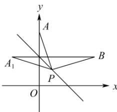

> [!faq]- 全练一本通解析
> **【解析】**
> 3
> 解析：设点 $A$ 关于直线 $x + y - 1 = 0$ 的对称点为 $A_{1}(x_{0},y_{0})$
> 
> 则 $\left\{\frac{y_{0}-2}{x_{0}}=1\right.$ ，解得 $\left\{\begin{aligned}x_{0}&=-1\\ y_{0}&=1\end{aligned}\right.$ ，即 $A_{1}(-1,1)$ ， $\left|PA\right|+\left|PB\right|=\left|PA_{1}\right|+\left|PB\right|\geq\left|A_{1}B\right|=3$ ，当且仅当 $A_{1}, P, B$ 共线时等号成立.
> 故答案为: 3.
