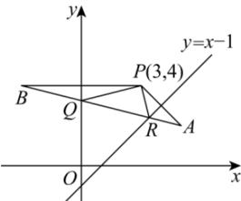

> [!faq]- 全练一本通解析
> **【解析】**
> $2\sqrt{17}$ 解析: 设 $P(3,4)$ 关于 y = x - 1 的对称点为 $A(m,n)$ ，关于 y 轴的对称点为 $B(-3,4)$ ，
> 则 $\left\{\begin{aligned}\frac{n+4}{2}&=\frac{m+3}{2}-1\\ \frac{n-4}{m-3}&\cdot1=-1\end{aligned}\right.$ ，解得 $\left\{\begin{aligned}m&=5\\ n&=2\end{aligned}\right.$ ，故 $A(5,2)$ ，
> 连接 AB 交 y 轴于点 Q，交直线 y=x-1 于点 R，连接 PQ, PR，
> 则 $\left|PQ\right|=\left|BQ\right|,\left|AR\right|=\left|PR\right|$ 此时 $\triangle PQR$ 的周长最小，最小值为 $\left|AB\right|=\sqrt{\left(-3-5\right)^{2}+\left(4-2\right)^{2}}=2\sqrt{17}$
> 
> 故答案为: $2 \sqrt{17}$
