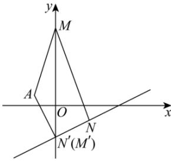

> [!faq]- 全练一本通解析
> **【解析】**
> $2\sqrt{5}$ 解析: 如图, 由已知得 $\left|AM\right| + \left|MN\right|$ 的最小值即为 $A(-2,1)$ 到直线 x - 2y - 6 = 0 的距离,
> 又直线 x - 2y - 6 = 0 与 y 轴的交点为 $N'(0, -3)$ ,
> 此时 $k_{AN'}=\frac{1+3}{-2-0}=-2$ 又直线 x-2y-6=0 斜率为 $\frac{1}{2}$ ，其与 $AN'$ 垂直，
> 即当 M, N 均为直线 x-2y-6=0 与 y 轴的交点时， $\left|AM\right|+\left|MN\right|$ 最小，
> 最小值为 $\frac{\left|-2-2-6\right|}{\sqrt{1+4}}=2\sqrt{5}$ .
> 故答案为： $2\sqrt{5}$
> 
