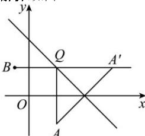

> [!faq]- 全练一本通解析
> **【答案】** 7
>
> **【解析】**
> 如图:
> 
> 设点 $A(2,-2)$ ，关于直线 l 的对称点为 $A'(x,y)$ ，
> 则 $\left\{\begin{aligned}\frac{x+2}{2}+\frac{y-2}{2}-4=0\\ \frac{y-(-2)}{x-2}=1\end{aligned}\right.$ ，解得 x=6,y=2，则 $A'(6,2)$ ，
> 则 $\left|A^{\prime}B\right|=\sqrt{(6+1)^{2}+(2-2)^{2}}=7,$ $\left|QA\right|+\left|QB\right|=\left|QA^{\prime}\right|+\left|QB\right|\geq\left|A^{\prime}B\right|=7,$ 故答案为：7.
