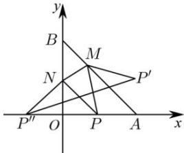

> [!faq]- 全练一本通解析
> **【答案】** $\sqrt{10}$
>
> **【解析】**
> 如图:
> 
> 作点 P 关于直线 AB 对称点 $P'(x,y)$ 和关于 y 轴对称点 $P''$ ，则 $PP' \perp AB$ ，并且 $P, P'$ 的中点在 AB 上，
> 直线 AB 的方程为： $y = -x + 2$ ，即 $k_{pp'} \cdot k_{AB} = -1, \frac{y}{x-1} \times (-1) = -1, y = x - 1 \ldots ①$ $P, P'$ 的中点坐标为 $\left(\frac{x+1}{2}, \frac{y}{2}\right)$ ，代入直线 AB 的方程
> 得： $\frac{y}{2}=-\frac{x+1}{2}+2,y=-x+3\ldots②,$ 联立①②解得 x=2,y=1，即 $P'(2,1)$ ，显然 $P''(-1,0)$ ， $\triangle PMN$ 的周长 $=PM + MN + PN = P''N + MN + P'M \geq P'P''$ ， $P'P''=\sqrt{(2+1)^{2}+(1-0)^{2}}=\sqrt{10}$
> 故答案为: $\sqrt{10}$ .
