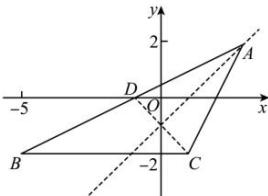

> [!faq]- 全练一本通解析
> **【答案】** (3,2)
>
> **【解析】**
> 如图所示, 可知点 A 在直线 x-y-1=0 上,
> 
> 令点 $D(x_{D},y_{D})$ 为点 $C(1, - 2)$ 关于直线 $x - y - 1 = 0$ 的对称点.由于直线 $CD$ 与直线 $x - y - 1 = 0$ 垂直，且线段 $CD$ 的中点在直线 $x - y - 1 = 0$ 上，于是就有 $\left\{ \begin{array}{l}\frac{y_D + 2}{x_D - 1} = -1\\ \frac{x_D + 1}{2} -\frac{y_D - 2}{2} -1 = 0 \end{array} \right.$ ，解得 $\left\{ \begin{array}{l}x_D = -1\\ y_D = 0 \end{array} \right.$ ，因此点 $D$ 的坐标为 $(-1,0)$ 根据对称性可知点 $D(-1,0)$ 在直线 $AB$ 上，又点 $B$ 的坐标为 $(-5, - 2)$ ，于是直线 $AB$ 的方程为 $\frac{y - 0}{-2 - 0} = \frac{x - (-1)}{-5 - (-1)}$ 即 $x - 2y + 1 = 0$ 由 $\left\{ \begin{array}{ll}x - 2y + 1 = 0\\ x - y - 1 = 0 \end{array} \right.$ ，解得 $\left\{ \begin{array}{ll}x = 3\\ y = 2 \end{array} \right.$ 得点 $A$ 的坐标为(3,2).故答案为：(3,2)
