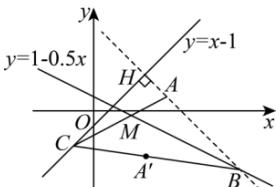

> [!faq]- 全练一本通解析
> **【答案】** （1） $B(10, - 4)$ （2） $x + 7y + 18 = 0$
>
> **【解析】**
> （1）设 $B(x_{0},y_{0})$ ，则由题意可知 $x_{0}+2y_{0}-2=0$ ①，
> 又 $AB \perp CH$ ，所以 $k_{AB} \cdot k_{CH} = \frac{y_{0} - 1}{x_{0} - 5} \times 1 = -1$ ②，
> 联立①②方程解得 $x_{0}=10, y_{0}=-4$ ，即 $B(10,-4)$ ；
> 
> (2)
> 设 A 关于直线 BM 的对称点 $A'(a,b)$ ，则有 $AA' \perp BM, AA'$ 的中点在直线 BM 上，
> 即 $\left\{\begin{aligned}k_{AA'} & \cdot k_{BM} = \frac{b-1}{a-5} \times (-0.5) = -1 \\ \frac{a+5}{2} + 2 \times \frac{b+1}{2} - 2 &= 0\end{aligned}\right.$ ，解之得 $\left\{\begin{aligned}a &= 3 \\ b &= -3\end{aligned}\right. \Rightarrow A'(3,-3)$ ，
> 显然直线 BM 为 $\angle ABA'$ 的角平分线，即直线 $A'B$ 与 BC 重合，
> 则 $k_{AB'} = \frac{-4 - (-3)}{10 - 3} = -\frac{1}{7}$ ，所以直线 BC 的方程为 $y + 3 = -\frac{1}{7}(x - 3) \Rightarrow x + 7y + 18 = 0$ .
