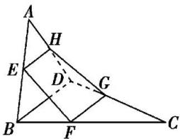

<!-- question-source:start -->
【16】如图所示, 已知空间四边形 ABCD, E, H 分别是边 AB, AD 的中点, F, G 分别是边 CB, CD 上的点, 且 $\overrightarrow{CF} = 2\overrightarrow{FB}$ , $\overrightarrow{CG} = 2\overrightarrow{GD}$ . 证明: 四边形 EFGH 是梯形.

<!-- question-source:end -->

![[Q00005327A1]]
