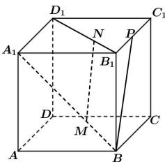

<!-- question-source:start -->
【18】如图, 在正方体 $ABCD - A_{1}B_{1}C_{1}D_{1}$ 中, 点 M, N 分别在线段 $A_{1}B$ , $D_{1}B_{1}$ 上, 且 $BM = \frac{1}{3}BA_{1}$ , $B_{1}N = \frac{1}{3}B_{1}D_{1}$ , P 为棱 $B_{1}C_{1}$ 的中点. 求证: MN // BP.

<!-- question-source:end -->

![[Q00005329A1]]
