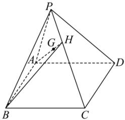

<!-- question-source:start -->
【28】（提升）如图所示, 若 P 为平行四边形 ABCD 所在平面外一点, H 为棱 PC 上的点, 且 $\frac{PH}{HC} = \frac{1}{2}$ , 点 G 在 AH 上, 且 $\frac{AG}{AH} = m$ , 若 G, B, P, D 四点共面, 求实数 m 的值.

<!-- question-source:end -->

![[Q00005339A1]]
