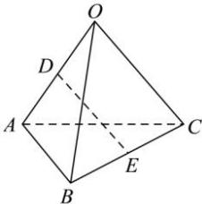

<!-- question-source:start -->
【33】（2024·广东清远高二）如图，四面体 OABC 中， $\angle OAB = \angle OAC = \angle BAC = 60^{\circ}$ ，OA = 1，AB = 1，AC = 3，D，E 是 OA，BC 的中点，则 DE = \_\_\_\_.

<!-- question-source:end -->

![[Q00005344A1]]
