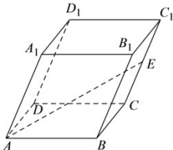

<!-- question-source:start -->
【34】（2024·广东中山高二开学）如图，在平行六面体 $ABCD-A_{1}B_{1}C_{1}D_{1}$ 中，AB=5，AD=3， $AA_{1}=4$ ， $\angle DAB=90^{\circ}$ ， $\angle BAA_{1}=\angle DAA_{1}=60^{\circ}$ ，E 是 $CC_{1}$ 的中点，设 $\overrightarrow{AB}=\vec{a}$ ， $\overrightarrow{AD}=\vec{b}$ ， $\overrightarrow{AA_{1}}=\vec{c}$ ，求 AE 的长.

<!-- question-source:end -->

![[Q00005345A1]]
