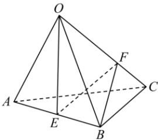

<!-- question-source:start -->
【36】(2024·福建泉州)如图,空间四边形OABC的各边及对角线长都为2,E是AB的中点,F在OC上,且 $\overrightarrow{OF}=2\overrightarrow{FC}$ ,求向量 $\overrightarrow{OE}$ 与向量 $\overrightarrow{BF}$ 所成角的余弦值.

<!-- question-source:end -->

![[Q00005347A1]]
