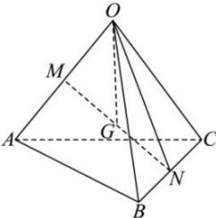

<!-- question-source:start -->
【42】(2023·全国高二)已知空间四边形OABC中， $\angle AOB = \angle BOC = \angle AOC$ ，且 $OA = OB = OC, M, N$ 分别是 $OA, BC$ 的中点， $G$ 是 $MN$ 的中点，用向量方法证明 $OG \perp BC$ 。

<!-- question-source:end -->

![[Q00005353A1]]
